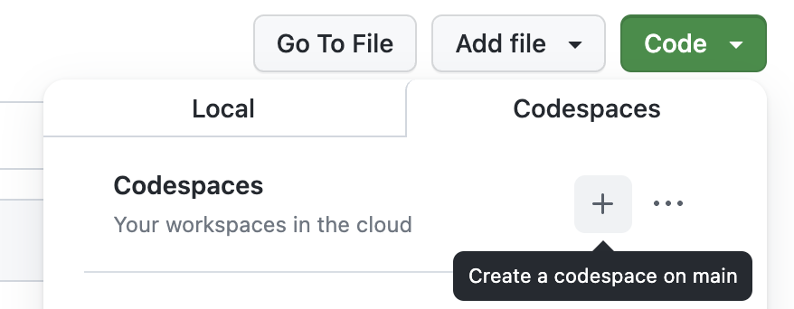
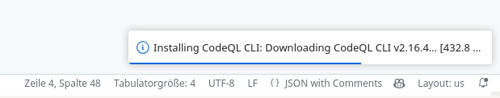
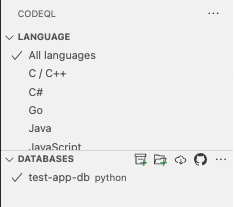

<h1 align="center">Finding vulnerabilities with CodeQL</h1>
<h3 align="center">OrangeCon 2024</h3>

<p align="center">
  <a href="#mega-prerequisites">Prerequisites</a> •
  <a href="#books-resources">Resources</a> •
  <a href="#learning-objectives">Learning Objectives</a>
</p>

- **Who is this for**: Security Engineers, Security Researchers, Developers.
- **What you'll learn**: Learn how to use CodeQL for code exploration and for finding security issues.
- **What you'll build**: Build a CodeQL query based on a security advisory to find a SQL injection.

## Learning Objectives

In this workshop will cover the following learning objectives:

- Understand how to use CodeQL in exploration and identification of security vulnerabilities.
- Be able to codify a security vulnerability as a CodeQL query.
- Be able to refine queries to find variants and increase precision.
- Understand how refined queries can be integrated into the developer workflow to prevent future vulnerabilities.

## :mega: Prerequisites

You can choose between two options to run the workshop exercises:
* [Option A: GitHub Codespace](#option-a-github-codespace) (Using a Browser or VS Code - CodeQL is run remotely on a Linux based GitHub Codespace in the cloud)
* [Option B: Local installation](#option-b-local-installation) (Using VS Code - CodeQL is run locally on your machine)

## Option A: GitHub Codespace

Use a remote GitHub Codespace to work on the workshop exercises.

### Prerequisites

* Stable internet connection throughout the workshop.
* GitHub account ([sign up](https://github.com/) for free)
* Browser or [Visual Studio Code](https://code.visualstudio.com/download) (VS Code) with the [GitHub Codespaces](https://marketplace.visualstudio.com/items?itemName=GitHub.codespaces) extension installed on your local machine.

Note: The first 120h hours per core of Codespace usage are free per month, we use a codespace with 4 cores for this workshop since 4 cores is the current maximum for free accounts. (If you have a Pro account, we recommend switching to an 8-core machine.)

### Step-by-Step

1. Login to your [GitHub](https://github.com/login) account
2. Go to the repo https://github.com/sylwia-budzynska/orangecon-2024-codeql-workshop / (short link: https://gh.io/orangecon-2024-ws)
3. Click on Code -> Codespaces
4. Click on the plus sign (+) to create a new codespace.



=> VS Code will start in your browser and a remote Codespace will be built (this may take some time).
If you are asked to open the workspace `vscode-codeql-starter.code-workspace` click on "Open Workspace".

5. Continue with [Selecting a CodeQL Database](#select-codeql-database)
6. Then [Test your installation](#test-your-installation)

### Use existing Codespace

If you've already prepared a Codespace this workshop you can simply start it by going to the [codespace repo](https://github.com/intrigus-lgtm/nullcon-berlin-2024-workshop) and clicking on "Code -> Codespaces" and then click on the randomly generated name of this codespace (this will be faster than creating a new one):


## Option B: Local installation

Use a local CodeQL installation to work on the workshop exercises.

### Prerequisites

* Requires downloading up to 2 GB of data in total.
* [Visual Studio Code](https://code.visualstudio.com/download) (VS Code) and `git` installed on your local machine.

### Step-by-Step

1. Install [VS Code extension for CodeQL](https://marketplace.visualstudio.com/items?itemName=GitHub.vscode-codeql)
2. In the terminal, in a directory specified by you: `$ git clone https://github.com/sylwia-budzynska/orangecon-2024-codeql-workshop.git`
3. `$ cd orangecon-2024-codeql-workshop`
4. `$ git submodule init`
5. `$ git submodule update --recursive`
6. In VS Code: File -> **Open Workspace from File...** `vscode-codeql-starter.code-workspace`

=> VS Code will start and the CodeQL CLI (binaries) will be installed. (approx. 500 MB of additional data need to be downloaded)



7. Continue with [Selecting a CodeQL Database](#select-codeql-database)
8. Then [Test your installation](#test-your-installation)

### Troubleshooting the local installation

In case you see errors such as:
* `Failed to run query: Could not resolve library path for [..]`
* `Could not resolve module [..]`
* `Could not resolve type [..]`

=> It is very likely that you missed cloning the git submodules (namely the ql repo). To fix this follow the [Step-by-Step](#step-by-step-1) instructions starting with step 3.

## Select CodeQL Database

1. Make sure you have the workspace `vscode-codeql-starter.code-workspace` open in VS Code.
2. Go To the CodeQL View
3. Click on "Choose Database from Archive" and select the `test-app-db.zip` file in the root of the repository.

Now you can test your installation:

## Test your installation

### Prerequisites

Make sure that the previously chosen CodeQL database is selected in the CodeQL view. (Click on "Select" if it's not)

=> When the database is selected it should look like this (note the checkmark):



### Step-by-Step

1. In VS Code: go to the workspace folder: `exercises-python`
2. Create a new file `test.ql`
3. add the following content: `select "Hello World!"`
4. Save file and right click in file on "CodeQL: Run Query on Selected Database"

=>  The output should look like this:


After finishing the technical prerequisites consider the following tutorials/guides for basic understanding of QL and Python query writing:

- [QL tutorials](https://codeql.github.com/docs/writing-codeql-queries/ql-tutorials/)
- [Basic query for Python code](https://codeql.github.com/docs/codeql-language-guides/basic-query-for-python-code/)
- [QL classes](https://codeql.github.com/docs/ql-language-reference/types/#classes)

## :books: Resources

- [QL tutorials](https://codeql.github.com/docs/writing-codeql-queries/ql-tutorials/)
- [CodeQL for Python language guide](https://codeql.github.com/docs/codeql-language-guides/codeql-for-python/)
- [CodeQL documentation](https://codeql.github.com/docs/)
- [QL language reference](https://codeql.github.com/docs/ql-language-reference/)
- [CodeQL library for Python](https://codeql.github.com/codeql-standard-libraries/python/)

## Workshop

Welcome to the workshop findiing vunlnerabilities with CodeQL!
This session will introduce fundamentals of security research and static analysis used when looking for vulnerabilities in software. We will use an example of a simple vulnerability, walk through how CodeQL could detect it, and provide examples on how the audience could use CodeQL to find vulnerabilities themselves.

Before we get started it is important that all of the prerequisites are met so you can participate in the workshop.

The workshop is divided into multiple sections and each section consists of exercises that build up to the final query.
For each section we provide *hints* that help you finish the exercise by providing you with references to QL classes and member predicates that you can use.

### Overview

In this workshop we will look for a known *Command injection vulnerabilities* in [.](https://securitylab.github.com/advisories/GHSL-2024-019_GHSL-2024-024_kohya_ss/) Such vulnerabilities can occur in applications when information that is controlled by a user makes its way to application code that insecurely construct a command and executes it. The command insecurely constructed from user input can be rewritten to perform unintended actions such as arbitrary command execution, disclosure of sensitive information.

The command injections discussed in this workshop are [CVE-2024-32022, CVE-2024-32026, CVE-2024-32025, CVE-2024-32027](https://securitylab.github.com/advisories/GHSL-2024-019_GHSL-2024-024_kohya_ss/).

## Theory

### Sources and sinks

Think about one of the most well-known vulnerabilities—command injection. It happens if user input is used in functions, that allow running commands in a shell directly on the servier. It allows an attacker to execute operating system (OS) commands on the server that is running an application, and typically fully compromise the application and its data.

The main cause of injection vulnerabilities is untrusted, user-controlled input being used in sensitive or dangerous functions of the program. To represent these in static analysis, we use terms such as data flow, sources, and sinks.

User input generally comes from entry points to an application—the origin of data. These include parameters in HTTP methods, such as GET and POST, or command line arguments to a program. These are called “sources.”

Continuing with our command injection, an example of a dangerous function that should not be called with unsanitized untrusted data could be `os.system`. These dangerous functions are called “sinks.” Note that just because a function is potentially dangerous, it does not mean it is immediately an exploitable vulnerability and has to be removed. Many sinks have ways of using them safely. Other exmaples of sinks, that shouldn't be used with user input are MySQLCursor.execute() from the MySQLdb library in Python (causing SQL injection) or Python’s eval() built-in function which evaluates arbitrary expressions (causing code injection).

For a vulnerability to be present, the unsafe, user-controlled input has to be used without proper sanitization or input validation in a dangerous function. In other words, there has to be a code path between the source and the sink, in which case we say that data flows from a source to a sink—there is a “data flow” from the source to the sink.


## Workshop part I - test database

In this workshop we are going to find command injections, where user input ends up in an `os.system` call.

Here is code vulnerable to command injection:
```python
import os
from flask import Flask, request

app = Flask(__name__)

@app.route("/command1")
def command_injection1():
    files = request.args.get('files', '')
    # Don't let files be `; rm -rf /`
    os.system("ls " + files)
```
The user input comes from a GET parameter of a Flask (popular web framework in Python) request, which is stored in variable `files`. `files` is then passed to the `os.system` call and concatenated with `ls`, leading to command injection.

In the first part of the workshop, we will write CodeQL queries to find sources and sinks, `os.ssytem` calls, on an intentionally vulnerable codebase. In the second part of the workshop, we are going to use those queries to find a command injection from a source to a sink in an open source software, [kohya_ss](https://github.com/bmaltais/kohya_ss) v22.6.1.

We will start by gradually builing a query to detect `os.system` calls and alter query for sources.

### 1. Find all calls to functions from external libraries

We can find all calls to functions from external libraries (not defined in the codebase) by using CodeQL's `ApiGraphs` module.

Use the tempalate below:
```codeql
import python
import semmle.python.ApiGraphs

from 	//TODO: fill me in. Use the `AST::CallNode` type and name your variable `call`
select 	//TODO: fill me in
```

<details>
<summary>Hints</summary>

- In the `from` clause, start by `API::` and press `Ctrl + Space` to see the types available in the API Graphs module.
- A call is represented by the `AST::CallNode` type. Create a variable with that type and the name `call`.
- To limit results only to calls in the root folder of the application (called `test-app`) add a ` where` clause with the condtion `where call.getLocation().getFile().getRelativePath().regexpMatch("test-app/.*")`.

</details>
<details>
<summary>Solution</summary>

```codeql
import python
import semmle.python.ApiGraphs

from API::CallNode call
where call.getLocation().getFile().getRelativePath().regexpMatch("test-app/.*")
select call, "Call to functions from external libraries"
```

</details>

### 2. Find all calls to `os.system`

<details>
<summary>Hints</summary>

- In the `from` clause, create a `call` variable of the `API::CallNode` type.
- In the `where` clause, use the equality operator `=` to assert that `call` is equal to the `os.system` calls.
- To find nodes corresponding to the `os` library, use the `API::moduleImport()` method with the `os` as the argument. To access the `system` function of the `os` library, use the `getMember()` predicate on `API::moduleImport()`. At last, get any `os.system` calls with the `getACall()` predicate.

</details>
<details>
<summary>Solution</summary>

```codeql
import python
import semmle.python.ApiGraphs

from API::CallNode call
where call = API::moduleImport("os").getMember("system").getACall() and
call.getLocation().getFile().getRelativePath().regexpMatch("test-app/.*")
select call, "Call to `os.system`"
```

</details>

### 3. Find the first arguments to calls to `os.system`
We want to find the first arguments to `os.system` calls, so later we can see if any user input flows into the first arguments (so into the command that will be executed).

<details>
<summary>Hints</summary>

- Fill out the template:
```codeql
import python
import semmle.python.ApiGraphs

from API::CallNode call
where call = API::moduleImport("os").getMember("system").getACall() and
call.getLocation().getFile().getRelativePath().regexpMatch("test-app/.*")
select call // TODO: fill me in. Type a dot `.` right after `call` and press `Ctrl/Cmd+Space` to see available predicates.
```


</details>
<details>
<summary>Solution</summary>

```codeql
import python
import semmle.python.ApiGraphs

from API::CallNode call
where call = API::moduleImport("os").getMember("system").getACall() and
call.getLocation().getFile().getRelativePath().regexpMatch("test-app/.*")
select call.getArg(0), "First argument of an `os.system` call"
```

</details>

### 4. Tranform your query that finds the calls to `os.system` into a CodeQL class
`classes` in CodeQL can be used to encapsulate reusable portions of logic. Classes represent single sets of values, and they can also include operations (known as member predicates) specific to that set of values. You have already seen numerous instances of CodeQL classes (API::CallNode) and  member predicates (getLocation() etc.)

<details>
<summary>Hints</summary>

 - To create a new type, we have to extend a supertype, here `API::CallNode`, give it a name, and a _characteristic predicate_ with the same name. We'll name our class, `OsSystemSink`.

Fill out the class template:
```codeql
class OsSystemSink extends API::CallNode {
	OsSystemSink() {
		//TODO: fill me in
	}
}
```
- Use the magic `this` keyword, that refers to the instances of the call nodes (`API::CallNode`s) that we are describing in the class. Use `this` to find the calls to `os.system` in the same way you did previously with `API::moduleImport`.
- Change the `where` clause to make your `call` variable an `instanceof` your new `OsSystemSink` class.

</details>
<details>
<summary>Solution</summary>

```codeql
import python
import semmle.python.ApiGraphs

class OsSystemSink extends API::CallNode {
	OsSystemSink() {
		this = API::moduleImport("os").getMember("system").getACall()
	}
}


from API::CallNode call
where call instanceof OsSystemSink
and call.getLocation().getFile().getRelativePath().regexpMatch("test-app/.*")
select call.getArg(0), "Call to os.system"
```

</details>

### 5. Find all sources with the RemoteFlowSource class

Now we switch to finding sources. Use a new file

Most sources are already modeled and in CodeQL, and have the `RemoteFlowSource` type. We can use the type to find any sources in a codebase.

<details>
<summary>Hints</summary>

- Import `semmle.python.dataflow.new.RemoteFlowSources` to use the RemoteFlowSource type.
- In the `from` clause, press `Ctrl/Cmd + Space` to see all available types.


</details>
<details>
<summary>Solution</summary>

```codeql
import python
import semmle.python.dataflow.new.RemoteFlowSources

from RemoteFlowSource rfs
where rfs.getLocation().getFile().getRelativePath().regexpMatch("test-app/.*")
select rfs
```

</details>

## Workshop part 2 - find command injections in kohya_ss

In the second part of the workshop, we are going to switch the codebase we are querying on to the `kohya_ss` one and find the data flows from sources to sinks in `kohya_ss`, which lead to command injections: [CVE-2024-32022, CVE-2024-32026, CVE-2024-32025, CVE-2024-32027](https://securitylab.github.com/advisories/GHSL-2024-019_GHSL-2024-024_kohya_ss/)

Before you start with the next exercise:
- Go to the CodeQL tab in VSCode, `Databases` section, and click on `kohya_ss-db`. A checkmark should appear. This will select the CodeQL database you are working on.

### 6. Find data flows from sources to the first argumnet to `os.system` calls

<details>
<summary>Hints</summary>

- Use the template below and note:
- in the `isSource` predicate, refine the `source` variable to be of the `RemoteFlowSource` type.
- in the `isSink` predicate, refine the `sink` variable to be the first argument to an `os.system` call. Do it using the `exists` mechanism and your `OsSystemSink` class.
  - `exists` is a mechanism for introducing temporary variables with a restricted scope. You can think of them as their own from-where-select. In this case, use `exists` to introduce the variable `call` with type `OsSystemSink` and then refine `sink` to be the first argument to the `call`.

```codeql
/**
 * @name DataFlow configuration
 * @kind path-problem
 * @id orangecon/dataflow-query
 */

import python
import semmle.python.dataflow.new.DataFlow
import semmle.python.dataflow.new.TaintTracking
import semmle.python.ApiGraphs
import MyFlow::PathGraph
import semmle.python.dataflow.new.RemoteFlowSources

//TODO: add previous class definition here

private module MyConfig implements DataFlow::ConfigSig {
  predicate isSource(DataFlow::Node source) {
    // TODO: fill me in
  }

  predicate isSink(DataFlow::Node sink) {
    // TODO: fill me in. Use the `exists` mechanism
      exists(<type> <variable> |
      sink = ...
  )
  }
}

module MyFlow = TaintTracking::Global<MyConfig>;

from MyFlow::PathNode source, MyFlow::PathNode sink
where MyFlow::flowPath(source, sink)
select sink.getNode(), source, sink, "Command injection"
```

</details>
<details>
<summary>Solution</summary>

```codeql
/**
 * @name DataFlow configuration
 * @kind path-problem
 * @id orangecon/dataflow-query
 */

import python
import semmle.python.dataflow.new.DataFlow
import semmle.python.dataflow.new.TaintTracking
import semmle.python.ApiGraphs
import semmle.python.dataflow.new.RemoteFlowSources
import MyFlow::PathGraph

class OsSystemSink extends API::CallNode {
	OsSystemSink() {
		this = API::moduleImport("os").getMember("system").getACall()
	}
}

private module MyConfig implements DataFlow::ConfigSig {
predicate isSource(DataFlow::Node source) {
	source instanceof RemoteFlowSource
}

predicate isSink(DataFlow::Node sink) {
	exists(OsSystemSink call |
	sink = call.getArg(0)
	)
}
}

module MyFlow = TaintTracking::Global<MyConfig>;

from MyFlow::PathNode source, MyFlow::PathNode sink
where MyFlow::flowPath(source, sink)
select sink.getNode(), source, sink, "Command injection"
```

</details>

You will see a lot of data flow paths, way more than the four that were reported. To make it easier for the maintainer of kohya_ss to fix these vulnerabilities, I wrote to him a list of vulnerable endpoints and sinks (around 15-20 of them) to get a better overview of the vulnerabilities. Creating a CVE for each of the issues would have been counterproductive.
## Bonus exercises, if time allows

### 7. Explore the sinks modeled in the `Concepts` module

The first argument to the `os.system` call is already modeled as a sink in CodeQL. All sinks that lead to command exection are of type `SystemCommandExecution`, and you can query any Python codebase for these sinks. There are more similar types for other vulnerabilties, which can be found in the [`Concepts`](https://github.com/github/codeql/blob/main/python/ql/lib/semmle/python/Concepts.qll) module.

:bulb: This is very interesting for security researchers - using the sinks, we can easily see what potentially dangerous functionality a project has, and review its usage.

<details>
<summary>Hints</summary>
Use the template and note:
- after `from` clause, press `Ctrl/Cmd+Space` to see available types. Begin typing `command` and see what appears

```codeql
import python
import semmle.python.Concepts

from // TODO: fill me in
select
```

</details>
<details>
<summary>Solution</summary>

```codeql
import python
import semmle.python.Concepts

from SystemCommandExecution cmd
where cmd.getLocation().getFile().getRelativePath().regexpMatch("test-app/.*")
select cmd, "Command Execution sink"
```

</details>

### 8. Query the codebase with the default queries

CodeQL queries for Python reside in the `ql/python/ql/src/Security` folder. There already exist queries for the most popular vulnerabilities: SQL injection, command injection, code injection, etc. Run the SQL injection query (CWE-089) on the test database.

:bulb: This is very interesting for security researchers - using the default queries, we can get a general idea of what the potential vulnerabilities might exist in a given project.


### 9. Run the default queries or your own queries using multi-repository variant analysis (MRVA)

The power of CodeQL lies in being able to reuse the CodeQL queries and models to run them on any codebase in the same language. We can run CodeQL queries on up to a 1000 repositories at once using multi-repository variant analysis (MRVA). The projects have to be hosted on GitHub.

:bulb: This is very interesting for security researchers - if you've found a potential dangerous sink or a source, you can add it to CodeQL (or run as a query) and do your research against a thousand repositories at once.


- Follow the setup in the [docs](https://docs.github.com/en/code-security/codeql-for-vs-code/getting-started-with-codeql-for-vs-code/running-codeql-queries-at-scale-with-multi-repository-variant-analysis).
- Note that MRVA runs using GitHub actions workflows. Actions workflows are free on public repositories, and paid on privates ones.
- After the setup, right-click and choose "CodeQL: Run Variant Analysis"

## Closing remarks
Check out these resources if you'd like to know more about:
- static analysis and how it works:
  -  [CodeQL zero to hero part 1: the fundamentals of static analysis for vulnerability research](https://github.blog/2023-03-31-codeql-zero-to-hero-part-1-the-fundamentals-of-static-analysis-for-vulnerability-research/). Link to the [challenges accompanying the blog post](https://github.com/sylwia-budzynska/codeql-zero-to-hero/tree/main/1)
- fundamentals of using CodeQL and its query language:
  - [CodeQL zero to hero part 2: getting started with CodeQL](https://github.blog/2023-06-15-codeql-zero-to-hero-part-2-getting-started-with-codeql/). Link to the [challenges accompanying the blog post](https://github.com/GitHubSecurityLab/codeql-zero-to-hero/tree/main/2)
- security research with CodeQL:
  - [CodeQL zero to hero part 3: security research](https://github.blog/2024-04-29-codeql-zero-to-hero-part-3-security-research-with-codeql/). Link to the [challenges accompanying the blog post](https://github.com/GitHubSecurityLab/codeql-zero-to-hero/tree/main/3)
