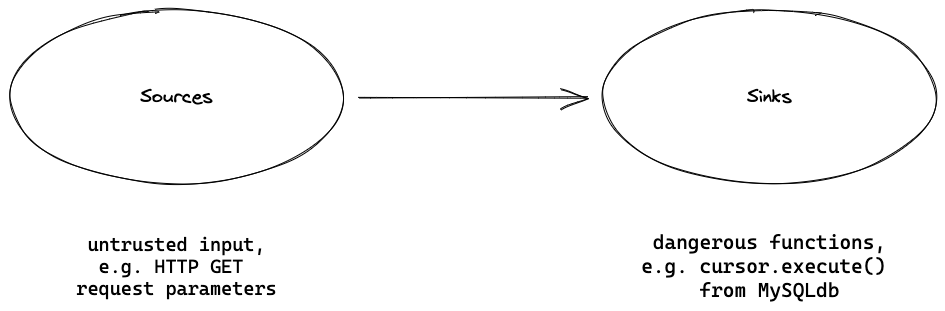

<h1 align="center">Finding vulnerabilities with CodeQL</h1>
<h3 align="center">OrangeCon 2024</h3>

<p align="center">
  <a href="#mega-prerequisites">Prerequisites</a> •
  <a href="#books-resources">Resources</a> •
  <a href="#learning-objectives">Learning Objectives</a>
</p>

- **Who is this for**: Security Engineers, Security Researchers, Developers.
- **What you'll learn**: Learn how to use CodeQL for code exploration and for finding security issues.
- **What you'll build**: Build a CodeQL query based on a security advisory to find a SQL injection.

## Learning Objectives

In this workshop will cover the following learning objectives:

- Understand how to use CodeQL in exploration and identification of security vulnerabilities.
- Be able to codify a security vulnerability as a CodeQL query.
- Be able to refine queries to find variants and increase precision.
- Understand how refined queries can be integrated into the developer workflow to prevent future vulnerabilities.

## :mega: Prerequisites

Before joining the workshop, there are a few items that you will need to install or bring with you.

- Install [Visual Studio Code](https://code.visualstudio.com/).
- Install the [CodeQL extension](https://marketplace.visualstudio.com/items?itemName=github.vscode-codeql).
  <details><summary>Walkthrough</summary>

  

  </details>
- Install the required CodeQL pack dependencies by running the command `CodeQL: Install pack dependencies` to install the dependencies for the pack `grehackworkshop/sql-injection-queries`.
  <details><summary>Walkthrough</summary>

  

  </details>
- Install [git LFS](https://docs.github.com/en/repositories/working-with-files/managing-large-files/installing-git-large-file-storage) to download the prepared databases or build the databases locally using the provide Make file. The Makefile requires the presence of [Docker](https://www.docker.com/).
- Test your setup perform the steps:

  1. Right-click on the file [xwiki-platform-ratings-api-12.8-db.zip](./xwiki-platform-ratings-api-12.8-db.zip) and run the command `CodeQL: Set Current Database`.
  2. Right-click on the file [SqlInjection.ql](./java/sql-injection/src/SqlInjection.ql) and run the command `CodeQL: Run Queries in Selected Files`.
  3. See the result `Hello OrangeCon!` in the *CodeQL Query Results* pane.

   If you run into issues with your setup feel free to ask for support at the start of the workshop.

   <details><summary>Walkthrough</summary>

   

   </details>

After finishing the technical prerequisites consider the following tutorials/guides for basic understanding of QL and Java query writing:

- [QL tutorials](https://codeql.github.com/docs/writing-codeql-queries/ql-tutorials/)
- [Basic query for Java code](https://codeql.github.com/docs/codeql-language-guides/basic-query-for-java-code/)
- [QL classes](https://codeql.github.com/docs/ql-language-reference/types/#classes)

## :books: Resources

- [QL tutorials](https://codeql.github.com/docs/writing-codeql-queries/ql-tutorials/)
- [CodeQL for Java language guide](https://codeql.github.com/docs/codeql-language-guides/codeql-for-java/)
- [CodeQL documentation](https://codeql.github.com/docs/)
- [SQL injection](https://portswigger.net/web-security/sql-injection)
- [QL language reference](https://codeql.github.com/docs/ql-language-reference/)
- [CodeQL library for Java](https://codeql.github.com/codeql-standard-libraries/java/)

## Workshop

Welcome to the workshop findiing vunlnerabilities with CodeQL!
This session will introduce fundamentals of security research and static analysis used when looking for vulnerabilities in software. We will use an example of a simple vulnerability, walk through how CodeQL could detect it, and provide examples on how the audience could use CodeQL to find vulnerabilities themselves.

Before we get started it is important that all of the prerequisites are met so you can participate in the workshop.

The workshop is divided into multiple sections and each section consists of exercises that build up to the final query.
For each section we provide *hints* that help you finish the exercise by providing you with references to QL classes and member predicates that you can use.

### Overview

In this workshop we will look for a known *Command injection vulnerabilities* in [.](https://securitylab.github.com/advisories/GHSL-2024-019_GHSL-2024-024_kohya_ss/) Such vulnerabilities can occur in applications when information that is controlled by a user makes its way to application code that insecurely construct a command and executes it. The command insecurely constructed from user input can be rewritten to perform unintended actions such as arbitrary command execution, disclosure of sensitive information.

The command injections discussed in this workshop are [CVE-2024-32022, CVE-2024-32026, CVE-2024-32025, CVE-2024-32027](https://securitylab.github.com/advisories/GHSL-2024-019_GHSL-2024-024_kohya_ss/).

## Theory

### Sources and sinks

Think about one of the most well-known vulnerabilities—command injection. It happens if user input is used in functions, that allow running commands in a shell directly on the servier. It allows an attacker to execute operating system (OS) commands on the server that is running an application, and typically fully compromise the application and its data.

The main cause of injection vulnerabilities is untrusted, user-controlled input being used in sensitive or dangerous functions of the program. To represent these in static analysis, we use terms such as data flow, sources, and sinks.

User input generally comes from entry points to an application—the origin of data. These include parameters in HTTP methods, such as GET and POST, or command line arguments to a program. These are called “sources.”

Continuing with our command injection, an example of a dangerous function that should not be called with unsanitized untrusted data could be `os.system`. These dangerous functions are called “sinks.” Note that just because a function is potentially dangerous, it does not mean it is immediately an exploitable vulnerability and has to be removed. Many sinks have ways of using them safely. Other exmaples of sinks, that shouldn't be used with user input are MySQLCursor.execute() from the MySQLdb library in Python (causing SQL injection) or Python’s eval() built-in function which evaluates arbitrary expressions (causing code injection).

For a vulnerability to be present, the unsafe, user-controlled input has to be used without proper sanitization or input validation in a dangerous function. In other words, there has to be a code path between the source and the sink, in which case we say that data flows from a source to a sink—there is a “data flow” from the source to the sink.



### Basic CodeQL query

## Workshop part I - test database

In the workshop, we are going to find command injections, where user input ends up in an `os.system` call.

Here is code vulnerable to command injection:
```
import os
from flask import Flask, request

app = Flask(__name__)

@app.route("/command1")
def command_injection1():
    files = request.args.get('files', '')
    # Don't let files be `; rm -rf /`
    os.system("ls " + files)
```
The user input comes from a GET parameter of a Flask (popular web framework in Python) request, which is started in variable `files`. `files` is then passed to `os.system` call and concatenated with `ls`, leading to command injection.

In the first part of the workshop, we will write CodeQL queries to find sources and sinks, `os.ssytem` calls, on an intentionally vulnerable codebase. In the second part of the workshop, we are going to use those queries to find a command injection from a source to a sink in an open source software, kohya_ss.

We will start by gradually builing a query to detect `os.system` calls and sources.

### 1. Find all calls to functions from external libraries

We can find all calls to functions from external libraries (not defined in the codebase) by using CodeQL's `ApiGraphs` module.

Use the tempalate below:
```codeql
import python
import semmle.python.ApiGraphs

from 	//TODO fill me in
select 	//TODO fill me in
```

<details>
<summary>Hints</summary>

- In the `from` clause, start by `API::` and press `Ctrl + Space` to see the types available in the API Graphs module.
- A call is represented by the `AST::CallNode` type. Create a variable with that type and the name `call`.
- To limit results only to calls in the root folder of the application (called `test-app`) add a ` where` clause with the condtion `where call.getLocation().getFile().getRelativePath().regexpMatch("test-app/.*")`.

</details>
<details>
<summary>Solution</summary>

```codeql
import python
import semmle.python.ApiGraphs

from API::CallNode call
where call.getLocation().getFile().getRelativePath().regexpMatch("test-app/.*")
select call, , "Call to functions from external libraries"
```

</details>

### 2. Find all calls to `os.system`

<details>
<summary>Hints</summary>

- In the `from` clause, create a `call` variable of the `API::CallNode` type.
- To find nodes corresponding to the `os` library, use the `API::moduleImport()` method with the `os` as the argument. To access the `system` function of the `os` library, use the `getMember()` predicate on `API::moduleImport()`. At last, get any `os.system` calls with the `getACall()` predicate.
- In the `where` clause, use the equality operator `=` to assert that `call` is equal to the `os.system` calls.


</details>
<details>
<summary>Solution</summary>

```codeql
import python
import semmle.python.ApiGraphs

from DataFlow::CallNode call
where call = API::moduleImport("os").getMember("system").getACall() and
call.getLocation().getFile().getRelativePath().regexpMatch("test-app/.*")
select call, "Call to `os.system`"
```

</details>

### 3. Find the first arguments to calls to `os.system`

<details>
<summary>Hints</summary>
- Here we are looking for arguments to a call, and we can't use the `API::CallNode`. Instead we have to use `DataFlow::CallCfgNode` in our variable declaration


</details>
<details>
<summary>Solution</summary>

```codeql
import python
import semmle.python.ApiGraphs

from DataFlow::CallCfgNode call
where call = API::moduleImport("os").getMember("system").getACall() and
call.getLocation().getFile().getRelativePath().regexpMatch("test-app/.*")
select call.getArg(0), "First argument of an `os.system` call"

```

</details>

### 4. Tranform your query that finds the first arguments to calls to `os.system` into a CodeQL class
`classes` in CodeQL can be used to encapsulate reusable portions of logic. Classes represent single sets of values, and they can also include operations (known as member predicates) specific to that set of values. You have already seen numerous instances of CodeQL classes (API::CallNode, DataFlow::CallCfgNode etc.) and  member predicates (getLocation() etc.)

<details>
<summary>Hints</summary>

Fill out the class template:
```codeql

class OsSystemSink extends DataFlow::CallCfgNode {
	OsSystemSink() {
		//TODO fill me in
	}
}
```
- Use the magic `this` keywor
</details>
<details>
<summary>Solution</summary>

```codeql
import python
import semmle.python.ApiGraphs

class OsSystemSink extends DataFlow::CallCfgNode {
	OsSystemSink() {
		this = API::moduleImport("os").getMember("system").getACall()
	}
}


from API::CallNode call
where call instanceof OsSystemSink
and call.getLocation().getFile().getRelativePath().regexpMatch("test-app/.*")
select call.getArg(0), "Call to os.system"
```

</details>

### 5. Find all sources with the RemoteFlowSource class

Now we switch to finding sources.

Most sources are already modeled and in CodeQL, and have the `RemoteFlowSource` type. We can use the type to find any sources in a codebase.

<details>
<summary>Hints</summary>
- Import `semmle.python.dataflow.new.RemoteFlowSources` to use the RemoteFlowSource type.
- In the `from` clause, press `Ctrl/Cmd + Space` to see all available types.


</details>
<details>
<summary>Solution</summary>

```codeql
import python
import semmle.python.dataflow.new.RemoteFlowSources

from RemoteFlowSource rfs
where rfs.getLocation().getFile().getRelativePath().regexpMatch("test-app/.*")
select rfs

```

</details>

## Workshop part 2 - find command injections in kohya_ss

In the second part of the workshop, we are going to switch the codebase we are querying on to the `kohya_ss` one and find the data flows from sources to sinks in `kohya_ss`, which lead to command injections: [CVE-2024-32022, CVE-2024-32026, CVE-2024-32025, CVE-2024-32027](https://securitylab.github.com/advisories/GHSL-2024-019_GHSL-2024-024_kohya_ss/)

Before you start with the next exercise:
- Go to the CodeQL tab in VSCode, `Databases` section, and click on `kohya_ss-db`. A checkmark should appear. This will select the CodeQL database you are working on.

### 6. Find data flows from sources to the first argumnet to `os.system` calls

<details>
<summary>Hints</summary>
- Use the template below and note:
- in the `isSource` predicate, limit the `source` variable to be of the `RemoteFlowSource` type
- in the `isSink` predicate, limit the `sink` variable to be the first argument to an `os.system` call. Note you can use your `OsSystemSink` class here.
```codeql
/**
 * @name DataFlow configuration
 * @kind path-problem
 * @id orangecon/dataflow-query
 */

import python
import semmle.python.dataflow.new.DataFlow
import semmle.python.dataflow.new.TaintTracking
import semmle.python.ApiGraphs
import MyFlow::PathGraph
import semmle.python.dataflow.new.RemoteFlowSources


private module MyConfig implements DataFlow::ConfigSig {
  predicate isSource(DataFlow::Node source) {
    // Define your source nodes here. Eg:
    // exists(DataFlow::CallCfgNode call |
    //   call = API::moduleImport("sample").getMember("source").getACall() and
    //   source = call
    // )
  }

  predicate isSink(DataFlow::Node sink) {
    // Define your sink nodes here. Eg:
    // exists(DataFlow::CallCfgNode call |
    //   call = API::moduleImport("sample").getMember("sink").getACall() and
    //   sink = call.getArg(0)
    // )
  }
}

module MyFlow = TaintTracking::Global<MyConfig>; // or DataFlow::Global<..>

from MyFlow::PathNode source, MyFlow::PathNode sink
where MyFlow::flowPath(source, sink)
select sink.getNode(), source, sink, "Sample TaintTracking query"
```

</details>
<details>
<summary>Solution</summary>

```codeql
/**
 * @name DataFlow configuration
 * @kind path-problem
 * @id orangecon/dataflow-query
 */

import python
import semmle.python.dataflow.new.DataFlow
import semmle.python.dataflow.new.TaintTracking
import semmle.python.ApiGraphs
import semmle.python.dataflow.new.RemoteFlowSources
import MyFlow::PathGraph

private module MyConfig implements DataFlow::ConfigSig {
predicate isSource(DataFlow::Node source) {
	source instanceof RemoteFlowSource
}

predicate isSink(DataFlow::Node sink) {
	exists(DataFlow::CallCfgNode call |
	call = API::moduleImport("os").getMember("system").getACall() and
	sink = call.getArg(0)
	)
}
}

module MyFlow = TaintTracking::Global<MyConfig>;

from MyFlow::PathNode source, MyFlow::PathNode sink
where MyFlow::flowPath(source, sink)
select sink.getNode(), source, sink, "Sample TaintTracking query"
```

</details>

## Bonus exercises, if time allows

### 7. Explore the sinks modeled in the `Concepts` module

The first argument to the `os.system` call is already modeled as a sink in CodeQL. All sinks that lead to command exection are of type `SystemCommandExecution`, and you can query any Python codebase for these sinks. There are more similar types for other vulnerabilties, which can be found in the [`Concepts`](https://github.com/github/codeql/blob/main/python/ql/lib/semmle/python/Concepts.qll) module.

:lightbulb: This is very interesting for security researchers - using the sinks, we can easily see what potentially dangerous functionality a project has, and review its usage.

<details>
<summary>Hints</summary>


</details>
<details>
<summary>Solution</summary>

```codeql
import python
import semmle.python.dataflow.new.RemoteFlowSources

from RemoteFlowSource rfs
where rfs.getLocation().getFile().getRelativePath().regexpMatch("test-app/.*")
select rfs

```

</details>

### 8. Query the codebase with the default queries


:lightbulb: This is very interesting for security researchers - using the default queries, we can get a general idea of what the potential vulnerabilities might exist in a given project.

<details>
<summary>Hints</summary>


</details>
<details>
<summary>Solution</summary>

```codeql


```

</details>

### 9. Run the default queries or your own queries using multi-repository variant analysis (MRVA)

The power of CodeQL lies in being able to reuse the CodeQL queries and models to run them on any codebase in the same language. We can run CodeQL queries on up to a 1000 repositories at once using multi-repository variant analysis (MRVA). The projects have to be hosted on GitHub.

:lightbulb: This is very interesting for security researchers - if you've found a potential dangerous sink or a source, you can


- Follow the setup in the [docs](https://docs.github.com/en/code-security/codeql-for-vs-code/getting-started-with-codeql-for-vs-code/running-codeql-queries-at-scale-with-multi-repository-variant-analysis).
- Note that MRVA runs using GitHub actions workflows. Actions workflows are free on public repositories, and paid on privates ones. You can set up a
